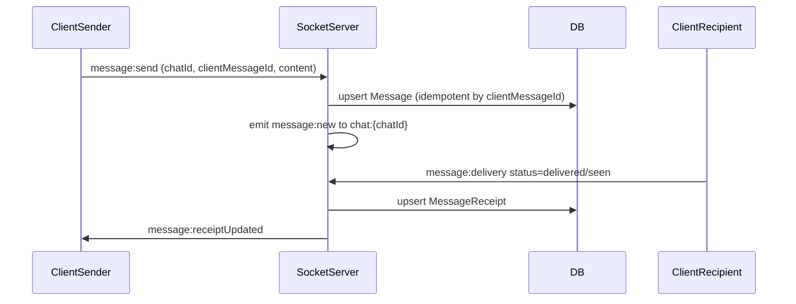
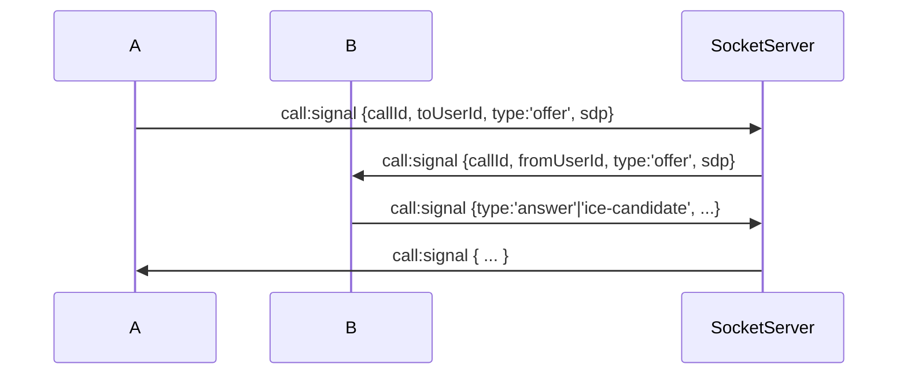

## 1) Scope + key assumptions (v1)
- Chats: `direct` (1:1) and `group` (multi-user).
- Messaging semantics: “sent/delivered/seen” are tracked per recipient device via server-side receipts; for offline users, delivery is considered when the recipient comes online and the message is available/acknowledged.
- Media: attachments via Cloudinary; backend stores Cloudinary metadata.
- Auth: Firebase Authentication (Google + Phone OTP) on the client; backend verifies Firebase ID tokens.
- Realtime transport: Socket.IO (WebSockets fallback) with authenticated namespaces/rooms.
- Presence + typing: use Redis for ephemeral state; persist minimal audit fields in Postgres.
- WebRTC: Socket.IO used only for signaling and call state updates.

## 2) High-level architecture (clean + modular)
**Backend (NestJS)**
- Layering per feature:
  - `controllers/` (HTTP + Socket handlers)
  - `application/` (use-cases/services coordinating domain logic)
  - `domain/` (entities/value objects + invariants)
  - `infrastructure/` (Prisma repositories, Redis adapters, Cloudinary adapter)
  - `dto/` (request/response DTOs)
- Cross-cutting:
  - `auth/` (Firebase token verification, Socket auth guard)
  - `realtime/` (Socket.IO event registry, room helpers)
  - `common/` (Result/Either, pagination types, error mapping)

**Shared types**
- `packages/shared/` holds:
  - DTO shapes for HTTP
  - Socket event payload typings
  - Validation schemas (or rely on zod/class-validator)
  - Common enums/constants (message status, chat type)

**Frontend (Next.js App Router)**
- Feature-based UI and data layer:
  - `src/features/<feature>/components`
  - `src/features/<feature>/hooks` (Zustand selectors + socket handlers)
  - `src/features/<feature>/api` (HTTP client typed with shared DTOs)
  - `src/app/(routes)/...` for route groups
- A single “realtime service” responsible for subscribing/unsubscribing Socket.IO events and dispatching into Zustand stores.

## 3) Proposed repository + folder structure
### Monorepo root
- `apps/web/` (Next.js)
- `apps/api/` (NestJS)
- `packages/shared/` (types + event contracts)
- `packages/shared-sql/` (optional: generated helpers from Prisma types)

### Backend folder structure
- `[apps/api/src/main.ts](apps/api/src/main.ts)`
- `[apps/api/src/common/](apps/api/src/common/)` (errors, pagination, logging, Result)
- `[apps/api/src/auth/](apps/api/src/auth/)`
  - `firebase/` (token verification)
  - `guards/` (HTTP + Socket)
- `[apps/api/src/realtime/](apps/api/src/realtime/)`
  - `socket/` (Socket.IO server init, namespace/room conventions)
  - `events/` (event name constants + dispatcher)
- `[apps/api/src/features/](apps/api/src/features/)` (each feature self-contained)
  - `users/`
  - `chats/` (create/join/list)
  - `messages/` (send/history)
  - `receipts/` (delivered/seen writes + reads)
  - `presence/` (online/offline + lastSeen)
  - `typing/` (typing indicator handling)
  - `notifications/` (unread counts + pushes)
  - `media/` (Cloudinary signed upload + metadata)
  - `calls/` (call sessions + signaling state)

### Frontend folder structure
- `[apps/web/src/app/](apps/web/src/app/)` (routes via App Router)
  - `(auth)/` (login callbacks, profile setup)
  - `(chat)/` (chat list, chat room, call UI)
- `[apps/web/src/features/](apps/web/src/features/)`
  - `auth/`
  - `chats/`
  - `messages/`
  - `presence/`
  - `typing/`
  - `notifications/`
  - `calls/`
  - `media/`
- `[apps/web/src/lib/](apps/web/src/lib/)`
  - `socket/` (Socket.IO client wrapper)
  - `api/` (typed HTTP client)
  - `store/` (Zustand stores)
  - `time/`, `pagination/`

## 4) Database schema (Prisma + PostgreSQL)
### Core entities
- `User`
  - Firebase identifiers (`firebaseUid`) and contact (`phoneE164`, optional)
  - `displayName`, `avatarUrl`
  - `createdAt`, `updatedAt`
- `Chat`
  - `type`: `direct` | `group`
  - `title` (group only), `avatarUrl` (optional)
- `ChatMember`
  - composite unique: `(chatId, userId)`
  - `role`: `admin` | `member`
  - `joinedAt`
  - per-member settings if needed later
- `Message`
  - `chatId`, `senderId`
  - `clientMessageId` (idempotency key from client)
  - `contentType`: `text` | `attachment` | `system`
  - `textContent` (nullable)
  - ordering: `createdAt` + optional monotonic `sequence`
- `MessageAttachment`
  - `messageId`, `cloudinaryPublicId`, `url`, `mimeType`, `size`
- `MessageReceipt`
  - tracks “delivered” and “seen” per `(messageId, recipientId)`
  - `deliveredAt`, `seenAt`
  - `updatedAt`

### Presence (ephemeral + persistent)
- `UserPresenceSnapshot` (optional, for last seen)
  - `userId`, `lastSeenAt`, `lastSeenIpOrRegion` (optional)
- Online presence itself lives in Redis:
  - key pattern: `presence:{userId}` => `{ status, updatedAt }`

### Typing (ephemeral)
- Redis only:
  - `typing:{chatId}:{userId}` => `{ isTyping, updatedAt }` with TTL.

### Notifications (unread state)
- `Notification` (optional) or simpler unread counters:
  - `UnreadCounter`: `(userId, chatId)` => `unreadCount`, `lastReadAt`

### Calls (signaling + state)
- `CallSession`
  - `callId`, `chatId` (or null for direct), `createdById`
  - `status`: `created` | `ringing` | `active` | `ended` | `missed`
  - `startedAt`, `endedAt`
- `CallParticipant`
  - `callId`, `userId`, `joinedAt`, `leftAt`, `reason` (optional)
- Signaling messages are typically not persisted unless you need audit; in v1 we can treat them as transient events.

### Prisma model outline (not code)
- Types:
  - `id` as `uuid`
  - `createdAt/updatedAt` timestamps
  - `clientMessageId` stored for idempotency per sender
- Indexes:
  - `Message(chatId, createdAt DESC)`
  - `Message(senderId, createdAt DESC)`
  - `MessageReceipt(recipientId, deliveredAt DESC)`
  - `ChatMember(userId)`

## 5) API contracts (HTTP REST, mobile-friendly)
General principles:
- All responses are typed and stable.
- Use cursor-based pagination: `before/after` or `cursor + limit`.
- All endpoints accept/return shared DTO shapes from `packages/shared`.

### Auth
- No “login” HTTP endpoints required (client uses Firebase), but backend needs:
  - `POST /auth/verify` (optional): returns normalized `appUser` profile.
  - `GET /me` returns user profile.
- Phone OTP flows can be handled entirely on the client with Firebase; backend just verifies tokens.

### Users
- `PATCH /users/me` update `displayName`, `avatar` metadata.
- `GET /users/:id` minimal profile.

### Chats
- `POST /chats/direct` create/get 1:1 chat with another user.
- `POST /chats/group` create group.
- `POST /chats/:chatId/members` add member(s) (group only).
- `GET /chats` list chats with last message preview + unread count.
- `GET /chats/:chatId/messages` history (cursor pagination).

### Messages
- `POST /chats/:chatId/messages`
  - Accepts `clientMessageId`, `content` or attachment metadata pointer.
  - Returns `serverMessageId`, timestamps.
- `POST /chats/:chatId/messages/:messageId/receipts`
  - `POST` is for “seen”/“delivered” writes from client (or socket-only, your choice). For v1, choose socket-based receipt writes.

### Media (Cloudinary)
- `POST /media/uploads/signature`
  - Returns Cloudinary signed params (or preset-based) for the client.
- `POST /media/attachments/confirm`
  - Client confirms upload metadata; returns attachment entity for message creation.

### Calls
- `POST /calls/sessions`
  - create call session (direct/group based on chatId and participants).
- `POST /calls/sessions/:callId/end`
  - end call reason.
- Signaling is primarily Socket.IO events.

## 6) Socket.IO events (typed contracts)
### Connection/auth
- Client connects with `auth: { token }` in Socket.IO.
- Server middleware verifies Firebase token and attaches `userId`.

### Room conventions
- `user:{userId}` personal room for direct delivery of events.
- `chat:{chatId}` for chat-scoped events.
- For typing/presence, optionally emit to `chat:{chatId}`.

### Realtime event groups
**Messaging**
- `message:send` (client -> server)
  - payload: `{ chatId, clientMessageId, content }`
- `message:new` (server -> chat room + sender?)
  - payload: `{ message }`
- `message:delivery` (client -> server) for delivered/seen acknowledgements
  - payload: `{ messageId, recipientId, status: 'delivered'|'seen', clientReceivedAt? }`
- `message:receiptUpdated` (server -> sender user room + optionally chat)
  - payload: `{ messageId, recipientId, deliveredAt?, seenAt? }`

**Typing indicator**
- `typing:start` / `typing:stop` or a single `typing:update`
  - `{ chatId, isTyping, clientTs }`
- `typing:state` (server -> chat room)
  - `{ chatId, userId, isTyping, updatedAt }`
- Server uses TTL to expire typing.

**Presence**
- On connect/disconnect and heartbeat:
  - `presence:online` / `presence:offline` (server -> relevant rooms)
- Client can also request presence:
  - `presence:query` -> `presence:state`

**Notifications**
- `notifications:unreadChanged` (server -> user room)
  - `{ chatId, unreadCount, lastReadAt }`

**Video signaling (WebRTC)**
- Signaling events (names chosen to match payloads):
  - `call:created`
  - `call:join`
  - `call:signal` (WebRTC SDP/ICE payload passthrough)
  - `call:leave`
  - `call:state` updates for UI
- WebRTC uses peer-to-peer media; Socket.IO only relays signaling.

## 7) End-to-end data flows
### A) Send message + delivery/seen

### B) Typing indicator
- Client emits `typing:update` with TTL; server broadcasts `typing:state` to `chat:{chatId}`.
- Server ignores stale updates and rate-limits per user per chat.

### C) Presence
- Server sets `presence:{userId}` in Redis on connect and clears on disconnect.
- Server broadcasts presence changes to relevant `user:{userId}` and/or `chat:{chatId}` rooms.

### D) WebRTC signaling

## 8) Tradeoffs and production concerns
- **Socket.IO vs raw WebSocket**: Socket.IO simplifies rooms, reconnection, auth, and ACKs; small overhead vs raw WS.
- **Delivery/seen semantics**: 
  - Tracking per-device is expensive; per-recipient-user is simpler.
  - “Delivered while offline” is ambiguous; recommended definition: delivered when message is persisted and recipient comes online and acknowledges receipt.
- **DB vs Redis for receipts**:
  - Receipts must be durable (DB).
  - Presence/typing must be ephemeral (Redis).
- **Idempotency**:
  - Use `clientMessageId` + `(senderId, chatId, clientMessageId)` unique constraint to prevent duplicates on retries.
- **Ordering**:
  - Use `createdAt` plus a stable sequence strategy per chat if you need strict ordering.
- **Scalability**:
  - If you run multiple API instances, you’ll need Socket.IO Redis adapter for room events.
- **Security**:
  - Verify Firebase token on every socket connection and optionally on reconnect.
  - Authorize chat membership before allowing `chat:{chatId}` subscriptions.

## 9) What I will implement next (after your approval)
- Create repo skeleton (monorepo), `packages/shared` event/DTO types.
- Implement backend feature modules + repositories (Prisma + Redis adapters).
- Define socket namespaces/rooms and a typed event dispatcher.
- Implement DB schema migrations and seed scripts.
- Build minimal frontend stores and realtime message handling wired to the API.
